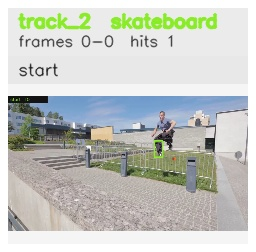

# davis__person_occlusion__parkour / track_2

## Summary
- class: skateboard (36)
- frames: 0-0 (1 frame span)
- hits: 1
- valid track: no
- had recovery: no
- relinked from: none
- fragment track ids: 2
- avg visual similarity: n/a
- total misses: 7
- max miss streak: 7

## Label Mix
- skateboard (36): 1 detections, confidence sum 0.273

## Relink Edges
- none

## Event Timeline
- frame 0: closed
- frame 0: created
- frame 5: lost

## Key Frames
- start: frame 0, fragment 2, [image](frames/start_f0000.jpg)

[track metadata](track.json)
