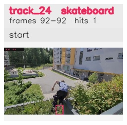

# davis__person_occlusion__parkour / track_24

## Summary
- class: skateboard (36)
- frames: 92-92 (1 frame span)
- hits: 1
- valid track: no
- had recovery: no
- relinked from: none
- fragment track ids: 24
- avg visual similarity: n/a
- total misses: 7
- max miss streak: 7

## Label Mix
- skateboard (36): 1 detections, confidence sum 0.503

## Relink Edges
- none

## Event Timeline
- frame 92: closed
- frame 92: created
- frame 93: lost

## Key Frames
- start: frame 92, fragment 24, [image](frames/start_f0092.jpg)

[track metadata](track.json)
