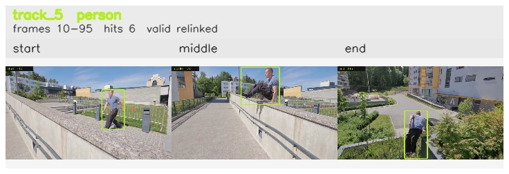

# davis__person_occlusion__parkour / track_5

## Summary
- class: person (0)
- frames: 10-95 (86 frame span)
- hits: 6
- valid track: yes
- had recovery: no
- relinked from: 7, 21
- fragment track ids: 5, 7, 21
- avg visual similarity: 0.7131
- total misses: 14
- max miss streak: 7

## Label Mix
- person (0): 6 detections, confidence sum 5.218

## Relink Edges
- 5 -> 7 via dino (score 0.6613)
- 7 -> 21 via spatial (score 0.4820)

## Event Timeline
- frame 10: created
- frame 15: activated
- frame 15: closed
- frame 20: lost
- frame 25: created
- frame 30: activated
- frame 30: closed
- frame 35: lost
- frame 90: created
- frame 95: activated
- frame 95: closed

## Key Frames
- start: frame 10, fragment 5, [image](frames/start_f0010.jpg)
- middle: frame 30, fragment 7, [image](frames/middle_f0030.jpg)
- end: frame 95, fragment 21, [image](frames/end_f0095.jpg)

[track metadata](track.json)
