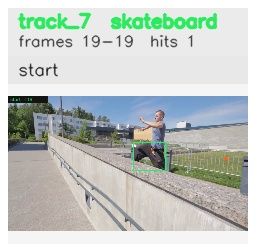

# davis__person_occlusion__parkour / track_7

## Summary
- class: skateboard (36)
- frames: 19-19 (1 frame span)
- hits: 1
- valid track: no
- had recovery: no
- relinked from: none
- fragment track ids: 7
- avg visual similarity: n/a
- total misses: 7
- max miss streak: 7

## Label Mix
- skateboard (36): 1 detections, confidence sum 0.368

## Relink Edges
- none

## Event Timeline
- frame 19: closed
- frame 19: created
- frame 20: lost

## Key Frames
- start: frame 19, fragment 7, [image](frames/start_f0019.jpg)

[track metadata](track.json)
