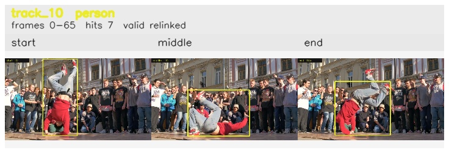

# davis__person_rotation__breakdance / track_10

## Summary
- class: person (0)
- frames: 0-65 (66 frame span)
- hits: 7
- valid track: yes
- had recovery: no
- relinked from: 45
- fragment track ids: 10, 45
- avg visual similarity: 0.8046
- total misses: 10
- max miss streak: 7

## Label Mix
- person (0): 7 detections, confidence sum 4.935

## Relink Edges
- 10 -> 45 via dino (score 0.8128)

## Event Timeline
- frame 0: created
- frame 5: activated
- frame 20: closed
- frame 25: lost
- frame 60: created
- frame 65: activated
- frame 65: closed
- frame 70: lost

## Key Frames
- start: frame 0, fragment 10, [image](frames/start_f0000.jpg)
- middle: frame 15, fragment 10, [image](frames/middle_f0015.jpg)
- end: frame 65, fragment 45, [image](frames/end_f0065.jpg)

[track metadata](track.json)
