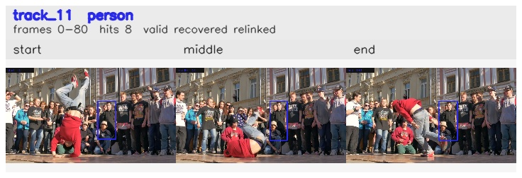

# davis__person_rotation__breakdance / track_11

## Summary
- class: person (0)
- frames: 0-80 (81 frame span)
- hits: 8
- valid track: yes
- had recovery: yes
- relinked from: 43
- fragment track ids: 11, 43
- avg visual similarity: 0.9273
- total misses: 9
- max miss streak: 7

## Label Mix
- person (0): 8 detections, confidence sum 4.126

## Relink Edges
- 11 -> 43 via dino (score 0.9437)

## Event Timeline
- frame 0: created
- frame 5: activated
- frame 15: closed
- frame 20: lost
- frame 55: created
- frame 60: lost
- frame 70: recovered
- frame 80: closed

## Key Frames
- start: frame 0, fragment 11, [image](frames/start_f0000.jpg)
- middle: frame 55, fragment 43, [image](frames/middle_f0055.jpg)
- end: frame 80, fragment 43, [image](frames/end_f0080.jpg)

[track metadata](track.json)
