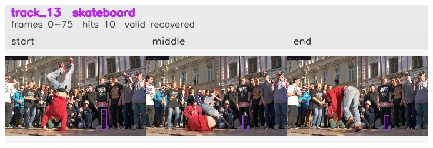

# davis__person_rotation__breakdance / track_13

## Summary
- class: skateboard (36)
- frames: 0-75 (76 frame span)
- hits: 10
- valid track: yes
- had recovery: yes
- relinked from: none
- fragment track ids: 13
- avg visual similarity: 0.9519
- total misses: 7
- max miss streak: 5

## Label Mix
- skateboard (36): 10 detections, confidence sum 4.491

## Relink Edges
- none

## Event Timeline
- frame 0: created
- frame 5: activated
- frame 20: lost
- frame 45: recovered
- frame 50: lost
- frame 55: recovered
- frame 75: closed
- frame 80: lost

## Key Frames
- start: frame 0, fragment 13, [image](frames/start_f0000.jpg)
- middle: frame 55, fragment 13, [image](frames/middle_f0055.jpg)
- end: frame 75, fragment 13, [image](frames/end_f0075.jpg)

[track metadata](track.json)
