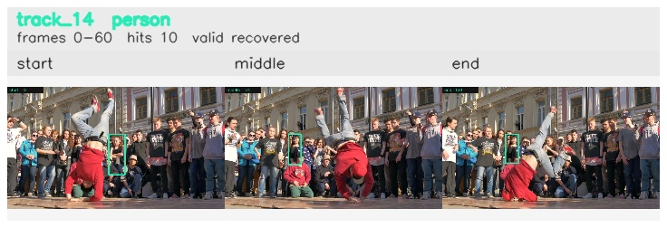

# davis__person_rotation__breakdance / track_14

## Summary
- class: person (0)
- frames: 0-60 (61 frame span)
- hits: 10
- valid track: yes
- had recovery: yes
- relinked from: none
- fragment track ids: 14
- avg visual similarity: 0.9206
- total misses: 7
- max miss streak: 4

## Label Mix
- person (0): 10 detections, confidence sum 3.631

## Relink Edges
- none

## Event Timeline
- frame 0: created
- frame 5: activated
- frame 20: lost
- frame 30: recovered
- frame 45: lost
- frame 50: recovered
- frame 60: closed
- frame 65: lost

## Key Frames
- start: frame 0, fragment 14, [image](frames/start_f0000.jpg)
- middle: frame 35, fragment 14, [image](frames/middle_f0035.jpg)
- end: frame 60, fragment 14, [image](frames/end_f0060.jpg)

[track metadata](track.json)
