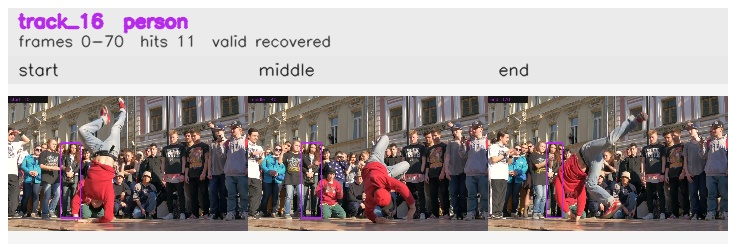

# davis__person_rotation__breakdance / track_16

## Summary
- class: person (0)
- frames: 0-70 (71 frame span)
- hits: 11
- valid track: yes
- had recovery: yes
- relinked from: none
- fragment track ids: 16
- avg visual similarity: 0.8261
- total misses: 6
- max miss streak: 2

## Label Mix
- person (0): 11 detections, confidence sum 4.902

## Relink Edges
- none

## Event Timeline
- frame 0: created
- frame 5: activated
- frame 10: lost
- frame 20: recovered
- frame 35: lost
- frame 40: recovered
- frame 65: lost
- frame 70: closed
- frame 70: recovered
- frame 75: lost

## Key Frames
- start: frame 0, fragment 16, [image](frames/start_f0000.jpg)
- middle: frame 40, fragment 16, [image](frames/middle_f0040.jpg)
- end: frame 70, fragment 16, [image](frames/end_f0070.jpg)

[track metadata](track.json)
