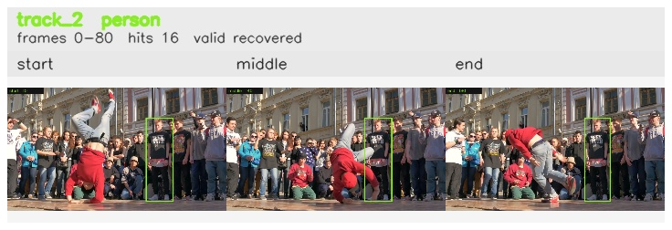

# davis__person_rotation__breakdance / track_2

## Summary
- class: person (0)
- frames: 0-80 (81 frame span)
- hits: 16
- valid track: yes
- had recovery: yes
- relinked from: none
- fragment track ids: 2
- avg visual similarity: 0.9085
- total misses: 1
- max miss streak: 1

## Label Mix
- person (0): 16 detections, confidence sum 13.041

## Relink Edges
- none

## Event Timeline
- frame 0: created
- frame 5: activated
- frame 45: lost
- frame 50: recovered
- frame 80: closed

## Key Frames
- start: frame 0, fragment 2, [image](frames/start_f0000.jpg)
- middle: frame 40, fragment 2, [image](frames/middle_f0040.jpg)
- end: frame 80, fragment 2, [image](frames/end_f0080.jpg)

[track metadata](track.json)
