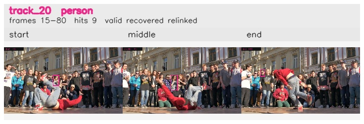

# davis__person_rotation__breakdance / track_20

## Summary
- class: person (0)
- frames: 15-80 (66 frame span)
- hits: 9
- valid track: yes
- had recovery: yes
- relinked from: 46
- fragment track ids: 20, 46
- avg visual similarity: 0.8647
- total misses: 10
- max miss streak: 7

## Label Mix
- person (0): 9 detections, confidence sum 2.931

## Relink Edges
- 20 -> 46 via dino (score 0.7923)

## Event Timeline
- frame 15: created
- frame 20: lost
- frame 30: recovered
- frame 45: closed
- frame 50: lost
- frame 60: created
- frame 65: activated
- frame 75: lost
- frame 80: closed
- frame 80: recovered

## Key Frames
- start: frame 15, fragment 20, [image](frames/start_f0015.jpg)
- middle: frame 45, fragment 20, [image](frames/middle_f0045.jpg)
- end: frame 80, fragment 46, [image](frames/end_f0080.jpg)

[track metadata](track.json)
