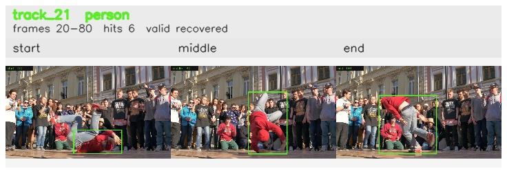

# davis__person_rotation__breakdance / track_21

## Summary
- class: person (0)
- frames: 20-80 (61 frame span)
- hits: 6
- valid track: yes
- had recovery: yes
- relinked from: none
- fragment track ids: 21
- avg visual similarity: 0.8130
- total misses: 7
- max miss streak: 6

## Label Mix
- person (0): 6 detections, confidence sum 3.786

## Relink Edges
- none

## Event Timeline
- frame 20: created
- frame 25: activated
- frame 35: lost
- frame 40: recovered
- frame 50: lost
- frame 80: closed
- frame 80: recovered

## Key Frames
- start: frame 20, fragment 21, [image](frames/start_f0020.jpg)
- middle: frame 40, fragment 21, [image](frames/middle_f0040.jpg)
- end: frame 80, fragment 21, [image](frames/end_f0080.jpg)

[track metadata](track.json)
