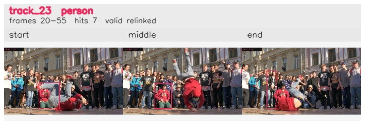

# davis__person_rotation__breakdance / track_23

## Summary
- class: person (0)
- frames: 20-55 (36 frame span)
- hits: 7
- valid track: yes
- had recovery: no
- relinked from: 41
- fragment track ids: 23, 41
- avg visual similarity: 0.8569
- total misses: 12
- max miss streak: 7

## Label Mix
- person (0): 7 detections, confidence sum 4.365

## Relink Edges
- 23 -> 41 via dino (score 0.6712)

## Event Timeline
- frame 20: created
- frame 25: activated
- frame 40: closed
- frame 45: lost
- frame 50: created
- frame 55: activated
- frame 55: closed
- frame 60: lost

## Key Frames
- start: frame 20, fragment 23, [image](frames/start_f0020.jpg)
- middle: frame 35, fragment 23, [image](frames/middle_f0035.jpg)
- end: frame 55, fragment 41, [image](frames/end_f0055.jpg)

[track metadata](track.json)
