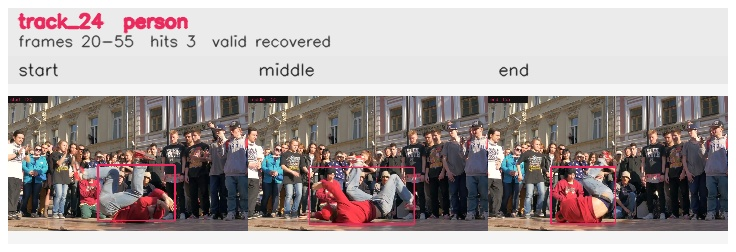

# davis__person_rotation__breakdance / track_24

## Summary
- class: person (0)
- frames: 20-55 (36 frame span)
- hits: 3
- valid track: yes
- had recovery: yes
- relinked from: none
- fragment track ids: 24
- avg visual similarity: 0.8803
- total misses: 10
- max miss streak: 5

## Label Mix
- person (0): 3 detections, confidence sum 1.482

## Relink Edges
- none

## Event Timeline
- frame 20: created
- frame 25: lost
- frame 50: recovered
- frame 55: closed
- frame 60: lost

## Key Frames
- start: frame 20, fragment 24, [image](frames/start_f0020.jpg)
- middle: frame 50, fragment 24, [image](frames/middle_f0050.jpg)
- end: frame 55, fragment 24, [image](frames/end_f0055.jpg)

[track metadata](track.json)
