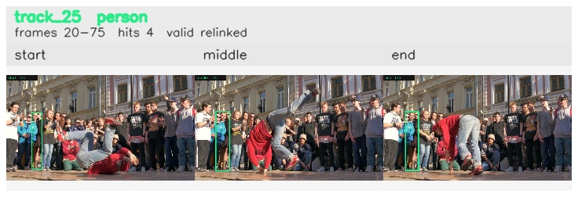

# davis__person_rotation__breakdance / track_25

## Summary
- class: person (0)
- frames: 20-75 (56 frame span)
- hits: 4
- valid track: yes
- had recovery: no
- relinked from: 50
- fragment track ids: 25, 50
- avg visual similarity: 0.9274
- total misses: 8
- max miss streak: 7

## Label Mix
- person (0): 4 detections, confidence sum 1.195

## Relink Edges
- 25 -> 50 via dino (score 0.9066)

## Event Timeline
- frame 20: created
- frame 25: activated
- frame 25: closed
- frame 30: lost
- frame 70: created
- frame 75: activated
- frame 75: closed
- frame 80: lost

## Key Frames
- start: frame 20, fragment 25, [image](frames/start_f0020.jpg)
- middle: frame 70, fragment 50, [image](frames/middle_f0070.jpg)
- end: frame 75, fragment 50, [image](frames/end_f0075.jpg)

[track metadata](track.json)
