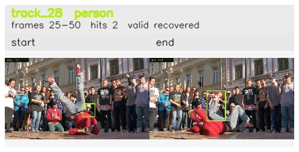

# davis__person_rotation__breakdance / track_28

## Summary
- class: person (0)
- frames: 25-50 (26 frame span)
- hits: 2
- valid track: yes
- had recovery: yes
- relinked from: none
- fragment track ids: 28
- avg visual similarity: 0.7147
- total misses: 10
- max miss streak: 6

## Label Mix
- person (0): 2 detections, confidence sum 0.556

## Relink Edges
- none

## Event Timeline
- frame 25: created
- frame 30: lost
- frame 50: closed
- frame 50: recovered
- frame 55: lost

## Key Frames
- start: frame 25, fragment 28, [image](frames/start_f0025.jpg)
- end: frame 50, fragment 28, [image](frames/end_f0050.jpg)

[track metadata](track.json)
