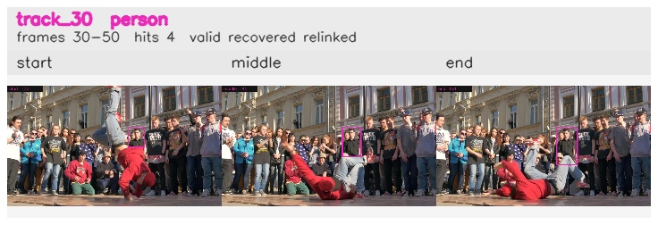

# davis__person_rotation__breakdance / track_30

## Summary
- class: person (0)
- frames: 30-50 (21 frame span)
- hits: 4
- valid track: yes
- had recovery: yes
- relinked from: 39
- fragment track ids: 30, 39
- avg visual similarity: 0.7756
- total misses: 14
- max miss streak: 7

## Label Mix
- person (0): 4 detections, confidence sum 1.868

## Relink Edges
- 30 -> 39 via dino (score 0.6314)

## Event Timeline
- frame 30: created
- frame 35: lost
- frame 40: closed
- frame 40: recovered
- frame 45: created
- frame 45: lost
- frame 50: activated
- frame 50: closed
- frame 55: lost

## Key Frames
- start: frame 30, fragment 30, [image](frames/start_f0030.jpg)
- middle: frame 45, fragment 39, [image](frames/middle_f0045.jpg)
- end: frame 50, fragment 39, [image](frames/end_f0050.jpg)

[track metadata](track.json)
