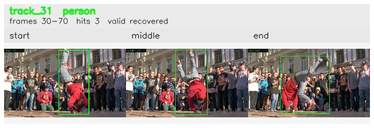

# davis__person_rotation__breakdance / track_31

## Summary
- class: person (0)
- frames: 30-70 (41 frame span)
- hits: 3
- valid track: yes
- had recovery: yes
- relinked from: none
- fragment track ids: 31
- avg visual similarity: 0.8658
- total misses: 8
- max miss streak: 6

## Label Mix
- person (0): 3 detections, confidence sum 2.194

## Relink Edges
- none

## Event Timeline
- frame 30: created
- frame 35: activated
- frame 40: lost
- frame 70: closed
- frame 70: recovered
- frame 75: lost

## Key Frames
- start: frame 30, fragment 31, [image](frames/start_f0030.jpg)
- middle: frame 35, fragment 31, [image](frames/middle_f0035.jpg)
- end: frame 70, fragment 31, [image](frames/end_f0070.jpg)

[track metadata](track.json)
