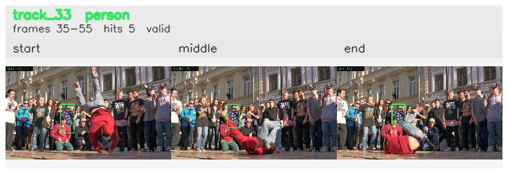

# davis__person_rotation__breakdance / track_33

## Summary
- class: person (0)
- frames: 35-55 (21 frame span)
- hits: 5
- valid track: yes
- had recovery: no
- relinked from: none
- fragment track ids: 33
- avg visual similarity: 0.8459
- total misses: 5
- max miss streak: 5

## Label Mix
- person (0): 5 detections, confidence sum 1.569

## Relink Edges
- none

## Event Timeline
- frame 35: created
- frame 40: activated
- frame 55: closed
- frame 60: lost

## Key Frames
- start: frame 35, fragment 33, [image](frames/start_f0035.jpg)
- middle: frame 45, fragment 33, [image](frames/middle_f0045.jpg)
- end: frame 55, fragment 33, [image](frames/end_f0055.jpg)

[track metadata](track.json)
