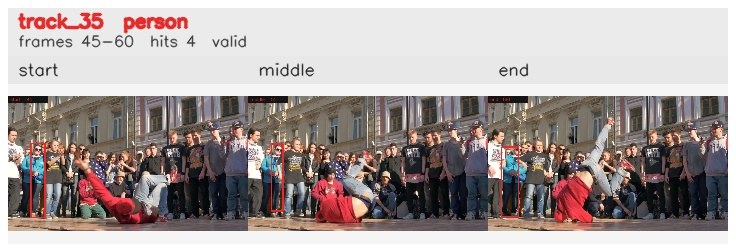

# davis__person_rotation__breakdance / track_35

## Summary
- class: person (0)
- frames: 45-60 (16 frame span)
- hits: 4
- valid track: yes
- had recovery: no
- relinked from: none
- fragment track ids: 35
- avg visual similarity: 0.8136
- total misses: 4
- max miss streak: 4

## Label Mix
- person (0): 4 detections, confidence sum 1.522

## Relink Edges
- none

## Event Timeline
- frame 45: created
- frame 50: activated
- frame 60: closed
- frame 65: lost

## Key Frames
- start: frame 45, fragment 35, [image](frames/start_f0045.jpg)
- middle: frame 55, fragment 35, [image](frames/middle_f0055.jpg)
- end: frame 60, fragment 35, [image](frames/end_f0060.jpg)

[track metadata](track.json)
