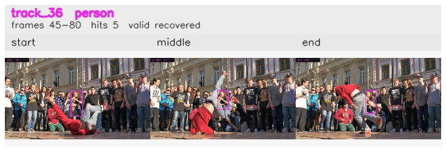

# davis__person_rotation__breakdance / track_36

## Summary
- class: person (0)
- frames: 45-80 (36 frame span)
- hits: 5
- valid track: yes
- had recovery: yes
- relinked from: none
- fragment track ids: 36
- avg visual similarity: 0.8159
- total misses: 3
- max miss streak: 1

## Label Mix
- person (0): 5 detections, confidence sum 1.765

## Relink Edges
- none

## Event Timeline
- frame 45: created
- frame 50: activated
- frame 55: lost
- frame 60: recovered
- frame 65: lost
- frame 70: recovered
- frame 75: lost
- frame 80: closed
- frame 80: recovered

## Key Frames
- start: frame 45, fragment 36, [image](frames/start_f0045.jpg)
- middle: frame 60, fragment 36, [image](frames/middle_f0060.jpg)
- end: frame 80, fragment 36, [image](frames/end_f0080.jpg)

[track metadata](track.json)
