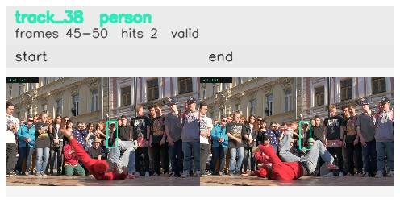

# davis__person_rotation__breakdance / track_38

## Summary
- class: person (0)
- frames: 45-50 (6 frame span)
- hits: 2
- valid track: yes
- had recovery: no
- relinked from: none
- fragment track ids: 38
- avg visual similarity: 0.8782
- total misses: 6
- max miss streak: 6

## Label Mix
- person (0): 2 detections, confidence sum 0.693

## Relink Edges
- none

## Event Timeline
- frame 45: created
- frame 50: activated
- frame 50: closed
- frame 55: lost

## Key Frames
- start: frame 45, fragment 38, [image](frames/start_f0045.jpg)
- end: frame 50, fragment 38, [image](frames/end_f0050.jpg)

[track metadata](track.json)
