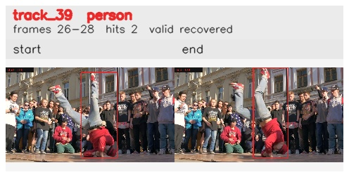

# davis__person_rotation__breakdance / track_39

## Summary
- class: person (0)
- frames: 26-28 (3 frame span)
- hits: 2
- valid track: yes
- had recovery: yes
- relinked from: none
- fragment track ids: 39
- avg visual similarity: 0.9291
- total misses: 8
- max miss streak: 7

## Label Mix
- person (0): 2 detections, confidence sum 0.797

## Relink Edges
- none

## Event Timeline
- frame 26: created
- frame 27: lost
- frame 28: closed
- frame 28: recovered
- frame 29: lost

## Key Frames
- start: frame 26, fragment 39, [image](frames/start_f0026.jpg)
- end: frame 28, fragment 39, [image](frames/end_f0028.jpg)

[track metadata](track.json)
