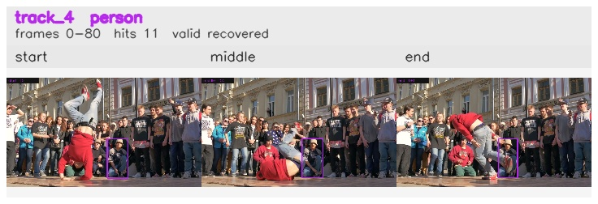

# davis__person_rotation__breakdance / track_4

## Summary
- class: person (0)
- frames: 0-80 (81 frame span)
- hits: 11
- valid track: yes
- had recovery: yes
- relinked from: none
- fragment track ids: 4
- avg visual similarity: 0.8489
- total misses: 6
- max miss streak: 5

## Label Mix
- person (0): 11 detections, confidence sum 7.415

## Relink Edges
- none

## Event Timeline
- frame 0: created
- frame 5: activated
- frame 20: lost
- frame 45: recovered
- frame 50: lost
- frame 55: recovered
- frame 80: closed

## Key Frames
- start: frame 0, fragment 4, [image](frames/start_f0000.jpg)
- middle: frame 55, fragment 4, [image](frames/middle_f0055.jpg)
- end: frame 80, fragment 4, [image](frames/end_f0080.jpg)

[track metadata](track.json)
