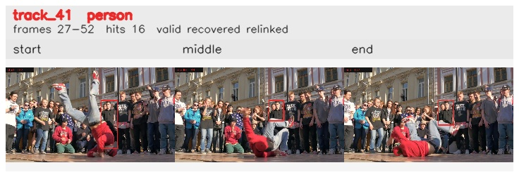

# davis__person_rotation__breakdance / track_41

## Summary
- class: person (0)
- frames: 27-52 (26 frame span)
- hits: 16
- valid track: yes
- had recovery: yes
- relinked from: 42, 47, 52
- fragment track ids: 41, 42, 47, 52
- avg visual similarity: 0.8548
- total misses: 30
- max miss streak: 7

## Label Mix
- person (0): 16 detections, confidence sum 6.300

## Relink Edges
- 41 -> 42 via dino (score 0.6475)
- 42 -> 47 via dino (score 0.6978)
- 47 -> 52 via dino (score 0.7471)

## Event Timeline
- frame 27: created
- frame 28: lost
- frame 29: closed
- frame 29: recovered
- frame 30: created
- frame 30: lost
- frame 31: activated
- frame 31: closed
- frame 32: lost
- frame 39: created
- frame 40: activated
- frame 41: closed
- frame 42: lost
- frame 43: created
- frame 44: activated
- frame 46: lost
- frame 47: recovered
- frame 52: closed
- frame 53: lost

## Key Frames
- start: frame 27, fragment 41, [image](frames/start_f0027.jpg)
- middle: frame 44, fragment 52, [image](frames/middle_f0044.jpg)
- end: frame 52, fragment 52, [image](frames/end_f0052.jpg)

[track metadata](track.json)
