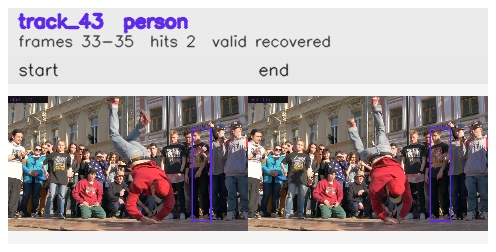

# davis__person_rotation__breakdance / track_43

## Summary
- class: person (0)
- frames: 33-35 (3 frame span)
- hits: 2
- valid track: yes
- had recovery: yes
- relinked from: none
- fragment track ids: 43
- avg visual similarity: 0.9632
- total misses: 8
- max miss streak: 7

## Label Mix
- person (0): 2 detections, confidence sum 0.771

## Relink Edges
- none

## Event Timeline
- frame 33: created
- frame 34: lost
- frame 35: closed
- frame 35: recovered
- frame 36: lost

## Key Frames
- start: frame 33, fragment 43, [image](frames/start_f0033.jpg)
- end: frame 35, fragment 43, [image](frames/end_f0035.jpg)

[track metadata](track.json)
