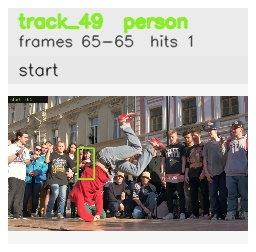

# davis__person_rotation__breakdance / track_49

## Summary
- class: person (0)
- frames: 65-65 (1 frame span)
- hits: 1
- valid track: no
- had recovery: no
- relinked from: none
- fragment track ids: 49
- avg visual similarity: n/a
- total misses: 3
- max miss streak: 3

## Label Mix
- person (0): 1 detections, confidence sum 0.307

## Relink Edges
- none

## Event Timeline
- frame 65: closed
- frame 65: created
- frame 70: lost

## Key Frames
- start: frame 65, fragment 49, [image](frames/start_f0065.jpg)

[track metadata](track.json)
