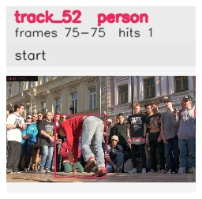

# davis__person_rotation__breakdance / track_52

## Summary
- class: person (0)
- frames: 75-75 (1 frame span)
- hits: 1
- valid track: no
- had recovery: no
- relinked from: none
- fragment track ids: 52
- avg visual similarity: n/a
- total misses: 1
- max miss streak: 1

## Label Mix
- person (0): 1 detections, confidence sum 0.865

## Relink Edges
- none

## Event Timeline
- frame 75: closed
- frame 75: created
- frame 80: lost

## Key Frames
- start: frame 75, fragment 52, [image](frames/start_f0075.jpg)

[track metadata](track.json)
