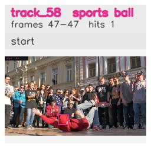

# davis__person_rotation__breakdance / track_58

## Summary
- class: sports ball (32)
- frames: 47-47 (1 frame span)
- hits: 1
- valid track: no
- had recovery: no
- relinked from: none
- fragment track ids: 58
- avg visual similarity: n/a
- total misses: 7
- max miss streak: 7

## Label Mix
- sports ball (32): 1 detections, confidence sum 0.444

## Relink Edges
- none

## Event Timeline
- frame 47: closed
- frame 47: created
- frame 48: lost

## Key Frames
- start: frame 47, fragment 58, [image](frames/start_f0047.jpg)

[track metadata](track.json)
