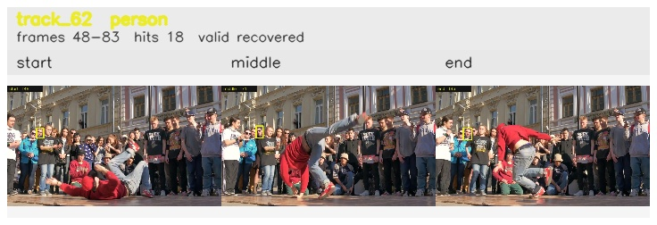

# davis__person_rotation__breakdance / track_62

## Summary
- class: person (0)
- frames: 48-83 (36 frame span)
- hits: 18
- valid track: yes
- had recovery: yes
- relinked from: none
- fragment track ids: 62
- avg visual similarity: 0.9539
- total misses: 18
- max miss streak: 5

## Label Mix
- person (0): 18 detections, confidence sum 5.443

## Relink Edges
- none

## Event Timeline
- frame 48: created
- frame 49: lost
- frame 51: recovered
- frame 55: lost
- frame 60: recovered
- frame 61: lost
- frame 65: recovered
- frame 66: lost
- frame 69: recovered
- frame 74: lost
- frame 78: recovered
- frame 83: closed

## Key Frames
- start: frame 48, fragment 62, [image](frames/start_f0048.jpg)
- middle: frame 71, fragment 62, [image](frames/middle_f0071.jpg)
- end: frame 83, fragment 62, [image](frames/end_f0083.jpg)

[track metadata](track.json)
