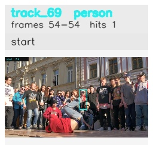

# davis__person_rotation__breakdance / track_69

## Summary
- class: person (0)
- frames: 54-54 (1 frame span)
- hits: 1
- valid track: no
- had recovery: no
- relinked from: none
- fragment track ids: 69
- avg visual similarity: n/a
- total misses: 7
- max miss streak: 7

## Label Mix
- person (0): 1 detections, confidence sum 0.263

## Relink Edges
- none

## Event Timeline
- frame 54: closed
- frame 54: created
- frame 55: lost

## Key Frames
- start: frame 54, fragment 69, [image](frames/start_f0054.jpg)

[track metadata](track.json)
