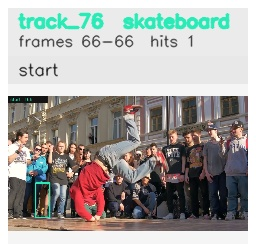

# davis__person_rotation__breakdance / track_76

## Summary
- class: skateboard (36)
- frames: 66-66 (1 frame span)
- hits: 1
- valid track: no
- had recovery: no
- relinked from: none
- fragment track ids: 76
- avg visual similarity: n/a
- total misses: 7
- max miss streak: 7

## Label Mix
- skateboard (36): 1 detections, confidence sum 0.341

## Relink Edges
- none

## Event Timeline
- frame 66: closed
- frame 66: created
- frame 67: lost

## Key Frames
- start: frame 66, fragment 76, [image](frames/start_f0066.jpg)

[track metadata](track.json)
