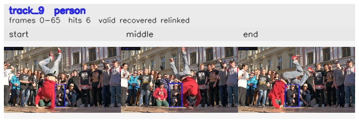

# davis__person_rotation__breakdance / track_9

## Summary
- class: person (0)
- frames: 0-65 (66 frame span)
- hits: 6
- valid track: yes
- had recovery: yes
- relinked from: 29
- fragment track ids: 9, 29
- avg visual similarity: 0.8104
- total misses: 14
- max miss streak: 7

## Label Mix
- person (0): 6 detections, confidence sum 3.712

## Relink Edges
- 9 -> 29 via dino (score 0.8573)

## Event Timeline
- frame 0: created
- frame 5: activated
- frame 5: closed
- frame 10: lost
- frame 30: created
- frame 35: activated
- frame 45: lost
- frame 65: closed
- frame 65: recovered
- frame 70: lost

## Key Frames
- start: frame 0, fragment 9, [image](frames/start_f0000.jpg)
- middle: frame 35, fragment 29, [image](frames/middle_f0035.jpg)
- end: frame 65, fragment 29, [image](frames/end_f0065.jpg)

[track metadata](track.json)
