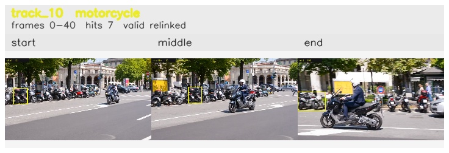

# davis__scooter_exit_reenter__scooter_black / track_10

## Summary
- class: motorcycle (3)
- frames: 0-40 (41 frame span)
- hits: 7
- valid track: yes
- had recovery: no
- relinked from: 64
- fragment track ids: 10, 64
- avg visual similarity: 0.8508
- total misses: 4
- max miss streak: 4

## Label Mix
- motorcycle (3): 7 detections, confidence sum 3.374

## Relink Edges
- 10 -> 64 via dino (score 0.7601)

## Event Timeline
- frame 0: created
- frame 5: activated
- frame 20: closed
- frame 25: lost
- frame 35: created
- frame 40: activated
- frame 40: closed

## Key Frames
- start: frame 0, fragment 10, [image](frames/start_f0000.jpg)
- middle: frame 15, fragment 10, [image](frames/middle_f0015.jpg)
- end: frame 40, fragment 64, [image](frames/end_f0040.jpg)

[track metadata](track.json)
