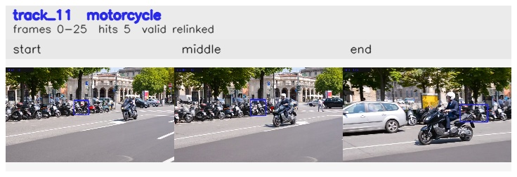

# davis__scooter_exit_reenter__scooter_black / track_11

## Summary
- class: motorcycle (3)
- frames: 0-25 (26 frame span)
- hits: 5
- valid track: yes
- had recovery: no
- relinked from: 43
- fragment track ids: 11, 43
- avg visual similarity: 0.8076
- total misses: 9
- max miss streak: 6

## Label Mix
- motorcycle (3): 5 detections, confidence sum 2.181

## Relink Edges
- 11 -> 43 via dino (score 0.8799)

## Event Timeline
- frame 0: created
- frame 5: activated
- frame 10: closed
- frame 15: lost
- frame 20: created
- frame 25: activated
- frame 25: closed
- frame 30: lost

## Key Frames
- start: frame 0, fragment 11, [image](frames/start_f0000.jpg)
- middle: frame 10, fragment 11, [image](frames/middle_f0010.jpg)
- end: frame 25, fragment 43, [image](frames/end_f0025.jpg)

[track metadata](track.json)
