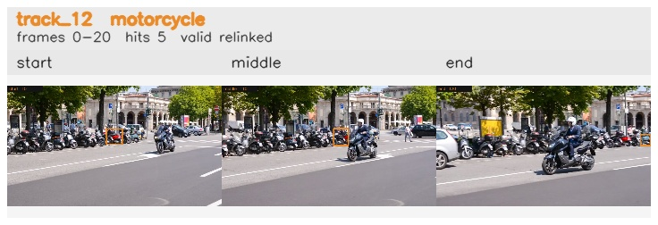

# davis__scooter_exit_reenter__scooter_black / track_12

## Summary
- class: motorcycle (3)
- frames: 0-20 (21 frame span)
- hits: 5
- valid track: yes
- had recovery: no
- relinked from: 38
- fragment track ids: 12, 38
- avg visual similarity: 0.7834
- total misses: 10
- max miss streak: 6

## Label Mix
- motorcycle (3): 5 detections, confidence sum 1.976

## Relink Edges
- 12 -> 38 via dino (score 0.7918)

## Event Timeline
- frame 0: created
- frame 5: activated
- frame 10: closed
- frame 15: created
- frame 15: lost
- frame 20: activated
- frame 20: closed
- frame 25: lost

## Key Frames
- start: frame 0, fragment 12, [image](frames/start_f0000.jpg)
- middle: frame 10, fragment 12, [image](frames/middle_f0010.jpg)
- end: frame 20, fragment 38, [image](frames/end_f0020.jpg)

[track metadata](track.json)
