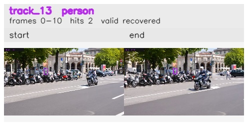

# davis__scooter_exit_reenter__scooter_black / track_13

## Summary
- class: person (0)
- frames: 0-10 (11 frame span)
- hits: 2
- valid track: yes
- had recovery: yes
- relinked from: none
- fragment track ids: 13
- avg visual similarity: 0.7640
- total misses: 7
- max miss streak: 6

## Label Mix
- person (0): 2 detections, confidence sum 0.755

## Relink Edges
- none

## Event Timeline
- frame 0: created
- frame 5: lost
- frame 10: closed
- frame 10: recovered
- frame 15: lost

## Key Frames
- start: frame 0, fragment 13, [image](frames/start_f0000.jpg)
- end: frame 10, fragment 13, [image](frames/end_f0010.jpg)

[track metadata](track.json)
