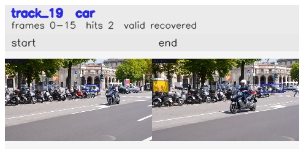

# davis__scooter_exit_reenter__scooter_black / track_19

## Summary
- class: car (2)
- frames: 0-15 (16 frame span)
- hits: 2
- valid track: yes
- had recovery: yes
- relinked from: none
- fragment track ids: 19
- avg visual similarity: 0.7102
- total misses: 7
- max miss streak: 5

## Label Mix
- car (2): 2 detections, confidence sum 1.007

## Relink Edges
- none

## Event Timeline
- frame 0: created
- frame 5: lost
- frame 15: closed
- frame 15: recovered
- frame 20: lost

## Key Frames
- start: frame 0, fragment 19, [image](frames/start_f0000.jpg)
- end: frame 15, fragment 19, [image](frames/end_f0015.jpg)

[track metadata](track.json)
