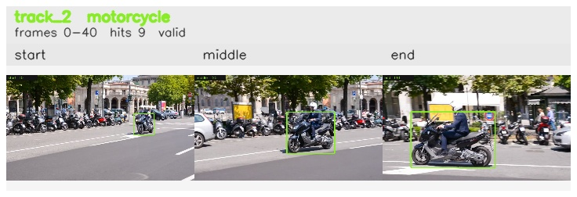

# davis__scooter_exit_reenter__scooter_black / track_2

## Summary
- class: motorcycle (3)
- frames: 0-40 (41 frame span)
- hits: 9
- valid track: yes
- had recovery: no
- relinked from: none
- fragment track ids: 2
- avg visual similarity: 0.8860
- total misses: 0
- max miss streak: 0

## Label Mix
- motorcycle (3): 9 detections, confidence sum 7.881

## Relink Edges
- none

## Event Timeline
- frame 0: created
- frame 5: activated
- frame 40: closed

## Key Frames
- start: frame 0, fragment 2, [image](frames/start_f0000.jpg)
- middle: frame 20, fragment 2, [image](frames/middle_f0020.jpg)
- end: frame 40, fragment 2, [image](frames/end_f0040.jpg)

[track metadata](track.json)
