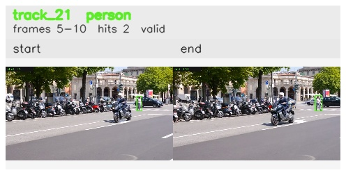

# davis__scooter_exit_reenter__scooter_black / track_21

## Summary
- class: person (0)
- frames: 5-10 (6 frame span)
- hits: 2
- valid track: yes
- had recovery: no
- relinked from: none
- fragment track ids: 21
- avg visual similarity: 0.7954
- total misses: 6
- max miss streak: 6

## Label Mix
- person (0): 2 detections, confidence sum 1.433

## Relink Edges
- none

## Event Timeline
- frame 5: created
- frame 10: activated
- frame 10: closed
- frame 15: lost

## Key Frames
- start: frame 5, fragment 21, [image](frames/start_f0005.jpg)
- end: frame 10, fragment 21, [image](frames/end_f0010.jpg)

[track metadata](track.json)
