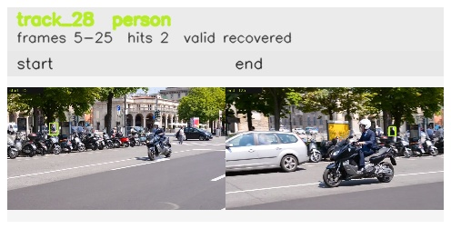

# davis__scooter_exit_reenter__scooter_black / track_28

## Summary
- class: person (0)
- frames: 5-25 (21 frame span)
- hits: 2
- valid track: yes
- had recovery: yes
- relinked from: none
- fragment track ids: 28
- avg visual similarity: 0.7242
- total misses: 6
- max miss streak: 3

## Label Mix
- person (0): 2 detections, confidence sum 0.517

## Relink Edges
- none

## Event Timeline
- frame 5: created
- frame 10: lost
- frame 25: closed
- frame 25: recovered
- frame 30: lost

## Key Frames
- start: frame 5, fragment 28, [image](frames/start_f0005.jpg)
- end: frame 25, fragment 28, [image](frames/end_f0025.jpg)

[track metadata](track.json)
