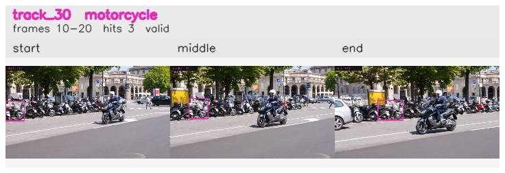

# davis__scooter_exit_reenter__scooter_black / track_30

## Summary
- class: motorcycle (3)
- frames: 10-20 (11 frame span)
- hits: 3
- valid track: yes
- had recovery: no
- relinked from: none
- fragment track ids: 30
- avg visual similarity: 0.7893
- total misses: 4
- max miss streak: 4

## Label Mix
- motorcycle (3): 3 detections, confidence sum 1.502

## Relink Edges
- none

## Event Timeline
- frame 10: created
- frame 15: activated
- frame 20: closed
- frame 25: lost

## Key Frames
- start: frame 10, fragment 30, [image](frames/start_f0010.jpg)
- middle: frame 15, fragment 30, [image](frames/middle_f0015.jpg)
- end: frame 20, fragment 30, [image](frames/end_f0020.jpg)

[track metadata](track.json)
