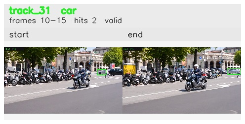

# davis__scooter_exit_reenter__scooter_black / track_31

## Summary
- class: car (2)
- frames: 10-15 (6 frame span)
- hits: 2
- valid track: yes
- had recovery: no
- relinked from: none
- fragment track ids: 31
- avg visual similarity: 0.7817
- total misses: 5
- max miss streak: 5

## Label Mix
- car (2): 2 detections, confidence sum 1.478

## Relink Edges
- none

## Event Timeline
- frame 10: created
- frame 15: activated
- frame 15: closed
- frame 20: lost

## Key Frames
- start: frame 10, fragment 31, [image](frames/start_f0010.jpg)
- end: frame 15, fragment 31, [image](frames/end_f0015.jpg)

[track metadata](track.json)
