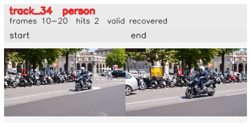

# davis__scooter_exit_reenter__scooter_black / track_34

## Summary
- class: person (0)
- frames: 10-20 (11 frame span)
- hits: 2
- valid track: yes
- had recovery: yes
- relinked from: none
- fragment track ids: 34
- avg visual similarity: 0.7609
- total misses: 5
- max miss streak: 4

## Label Mix
- person (0): 2 detections, confidence sum 0.701

## Relink Edges
- none

## Event Timeline
- frame 10: created
- frame 15: lost
- frame 20: closed
- frame 20: recovered
- frame 25: lost

## Key Frames
- start: frame 10, fragment 34, [image](frames/start_f0010.jpg)
- end: frame 20, fragment 34, [image](frames/end_f0020.jpg)

[track metadata](track.json)
