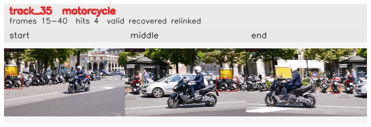

# davis__scooter_exit_reenter__scooter_black / track_35

## Summary
- class: motorcycle (3)
- frames: 15-40 (26 frame span)
- hits: 4
- valid track: yes
- had recovery: yes
- relinked from: 61
- fragment track ids: 35, 61
- avg visual similarity: 0.7811
- total misses: 5
- max miss streak: 4

## Label Mix
- motorcycle (3): 3 detections, confidence sum 2.101
- person (0): 1 detections, confidence sum 0.501

## Relink Edges
- 35 -> 61 via dino (score 0.7439)

## Event Timeline
- frame 15: created
- frame 20: activated
- frame 20: closed
- frame 25: lost
- frame 30: created
- frame 35: lost
- frame 40: closed
- frame 40: recovered

## Key Frames
- start: frame 15, fragment 35, [image](frames/start_f0015.jpg)
- middle: frame 30, fragment 61, [image](frames/middle_f0030.jpg)
- end: frame 40, fragment 61, [image](frames/end_f0040.jpg)

[track metadata](track.json)
