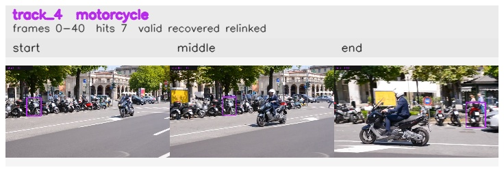

# davis__scooter_exit_reenter__scooter_black / track_4

## Summary
- class: motorcycle (3)
- frames: 0-40 (41 frame span)
- hits: 7
- valid track: yes
- had recovery: yes
- relinked from: 57
- fragment track ids: 4, 57
- avg visual similarity: 0.8234
- total misses: 6
- max miss streak: 5

## Label Mix
- motorcycle (3): 7 detections, confidence sum 3.426

## Relink Edges
- 4 -> 57 via dino (score 0.8788)

## Event Timeline
- frame 0: created
- frame 5: activated
- frame 15: closed
- frame 20: lost
- frame 25: created
- frame 30: activated
- frame 35: lost
- frame 40: closed
- frame 40: recovered

## Key Frames
- start: frame 0, fragment 4, [image](frames/start_f0000.jpg)
- middle: frame 15, fragment 4, [image](frames/middle_f0015.jpg)
- end: frame 40, fragment 57, [image](frames/end_f0040.jpg)

[track metadata](track.json)
