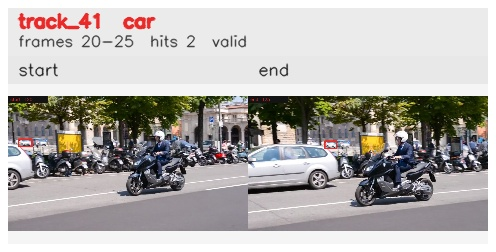

# davis__scooter_exit_reenter__scooter_black / track_41

## Summary
- class: car (2)
- frames: 20-25 (6 frame span)
- hits: 2
- valid track: yes
- had recovery: no
- relinked from: none
- fragment track ids: 41
- avg visual similarity: 0.7755
- total misses: 3
- max miss streak: 3

## Label Mix
- car (2): 2 detections, confidence sum 1.274

## Relink Edges
- none

## Event Timeline
- frame 20: created
- frame 25: activated
- frame 25: closed
- frame 30: lost

## Key Frames
- start: frame 20, fragment 41, [image](frames/start_f0020.jpg)
- end: frame 25, fragment 41, [image](frames/end_f0025.jpg)

[track metadata](track.json)
