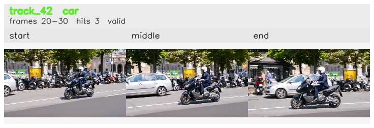

# davis__scooter_exit_reenter__scooter_black / track_42

## Summary
- class: car (2)
- frames: 20-30 (11 frame span)
- hits: 3
- valid track: yes
- had recovery: no
- relinked from: none
- fragment track ids: 42
- avg visual similarity: 0.8004
- total misses: 2
- max miss streak: 2

## Label Mix
- car (2): 3 detections, confidence sum 1.693

## Relink Edges
- none

## Event Timeline
- frame 20: created
- frame 25: activated
- frame 30: closed
- frame 35: lost

## Key Frames
- start: frame 20, fragment 42, [image](frames/start_f0020.jpg)
- middle: frame 25, fragment 42, [image](frames/middle_f0025.jpg)
- end: frame 30, fragment 42, [image](frames/end_f0030.jpg)

[track metadata](track.json)
