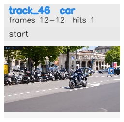

# davis__scooter_exit_reenter__scooter_black / track_46

## Summary
- class: car (2)
- frames: 12-12 (1 frame span)
- hits: 1
- valid track: no
- had recovery: no
- relinked from: none
- fragment track ids: 46
- avg visual similarity: n/a
- total misses: 7
- max miss streak: 7

## Label Mix
- car (2): 1 detections, confidence sum 0.258

## Relink Edges
- none

## Event Timeline
- frame 12: closed
- frame 12: created
- frame 13: lost

## Key Frames
- start: frame 12, fragment 46, [image](frames/start_f0012.jpg)

[track metadata](track.json)
