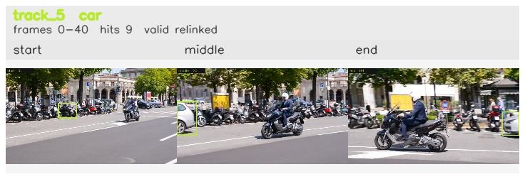

# davis__scooter_exit_reenter__scooter_black / track_5

## Summary
- class: car (2)
- frames: 0-40 (41 frame span)
- hits: 9
- valid track: yes
- had recovery: no
- relinked from: 40
- fragment track ids: 5, 40
- avg visual similarity: 0.8422
- total misses: 5
- max miss streak: 5

## Label Mix
- car (2): 5 detections, confidence sum 4.024
- motorcycle (3): 4 detections, confidence sum 1.841

## Relink Edges
- 5 -> 40 via dino (score 0.6709)

## Event Timeline
- frame 0: created
- frame 5: activated
- frame 15: closed
- frame 20: created
- frame 20: lost
- frame 25: activated
- frame 40: closed

## Key Frames
- start: frame 0, fragment 5, [image](frames/start_f0000.jpg)
- middle: frame 20, fragment 40, [image](frames/middle_f0020.jpg)
- end: frame 40, fragment 40, [image](frames/end_f0040.jpg)

[track metadata](track.json)
